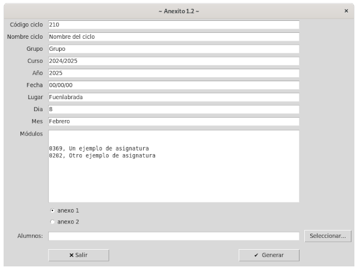

# Anexito

Autorellenador de campos de formularios en PDF para anexos sobre valoración de acceso a la FFE.

Puedes descargar la [última versión para Windows de este enlace](https://github.com/sdemingo/anexito/releases/download/anexito-1.0/anexito-1.0.exe).


{ width: 200px; }


## Uso general

Para generar los anexos debes rellenar todos los datos incluidos en la interfaz visual que se muestra al arrancar. Es importante prestar atención al campo llamado «Módulos». En el debe aparecer en líneas separadas tanto **los códigos como los nombres de estos módulos separados por una coma**. Un ejemplo de lo que debe haber escrito en este campo puede ser lo siguiente:

```

0369, Un ejemplo de asignatura
0202, Otro ejemplo de asignatura

```

El último requisito que se necesita tener creado es el fichero con los nombres de los alumno. Este fichero puede editarse con cualquier editor de textos y debe tener un alumno por línea. **Usa la coma para separar el nombre del apellido** como en el ejemplo siguiente:

```
Sergio,García
Jose María,Ruíz del Olmo
Francisco José,Pérez
Marta,García
Pablo Antonio,de Miguel
```

Pulsando el botón `Generar` los anexos son creados en un directorio local
llamado `anexos`.

## Uso por línea de comandos

Para usar `anexito` a través de la línea de comandos edita el fichero `datos.py`
con los parámetros apropiados a tus necesidades. En el caso de los módulos o
asignaturas recuerda seguir el formato indicado anteriormente. Igualmente
escribe los nombres completos de los alumnos en el fichero `nombres.txt` o en
otro fichero a tu elección también siguiendo la indicación anterior para estos.

Una vez hecho esto solo necesitas ejecutar cambiando `nombres.txt` por el nombre del fichero donde hayas escrito los nombres:

* `./anexito -a1 nombres.txt`: Para obtener los Anexos I
* `./anexito -a2 nombres.txt`: Para obtener los Anexos II


## Construcción y dependencias

Necesita la librería [fillpdf](https://github.com/t-houssian/fillpdf). Para instalarla usar `pip`:

```
pip install fillpdf
```

